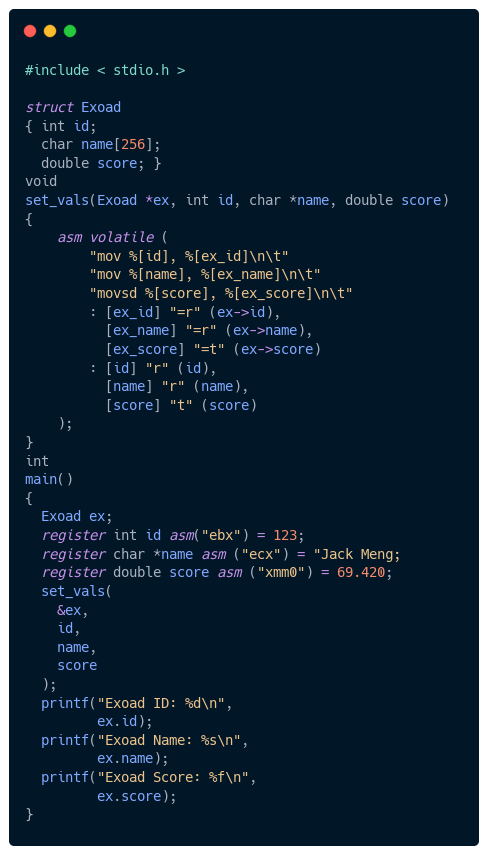

 

# &nbsp;Jack's Universal Codemap

A documentation of a syntax to make code much more readable and easier to navigate.

This documentation includes styling for the following standards:
1. Java (8+ Compliant)
2. C/C++ (98 Compliant, 98 Complianet)
3. Haxe 
4. Dart (Optional)
5. JavaScript

To find the proper styling for individual languages go to their designated folders:
 * [JavaScript](./javascript/)
 * [Java](./java/)
 * [C++](./cxx/)
 * [Dart](./dart/)
 * [Haxe](./haxe/)
 * [C](./c/)

## <strong>Why?</strong>
The main motive behind having a different formatting for my code is that
it suits me much more than the blue book of the language itself. Although it might seem messy at first, for some of these languages like Java and Haxe, these expanded syntax helps to reveal important attributes in the verbose languages. Additionally, this syntax helps to reduce visibility of irrelevant
details, like visibility modifiers, meta-data tags, extraneous single line functions, etc..

## <strong>General formula</strong>
All of the syntax formatting follow a similar guideline for all languages if they have similar combination of symbols and/or keywords. You can check these out [here](/.global/)
